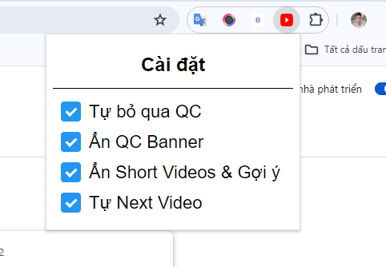

## New Features

-   Popup (Settings)

    

### How To Install

1. Download [source code](https://github.com/quangtrong1506/skip_ad_youtube/archive/refs/heads/main.zip)

2. Extract files

3. Open the browser you need to use

4. Open tab <b>Manage Extension</b>

5. Turn on <b>Developer Mode</b> in the upper right corner. Next,Click the Load <b>unpacked button</b>
   
6. Chọn thư mục <b>dist</b> đã giải nén bên trên => Click <b>Select Folder</b> => <b>Done</b>
   
